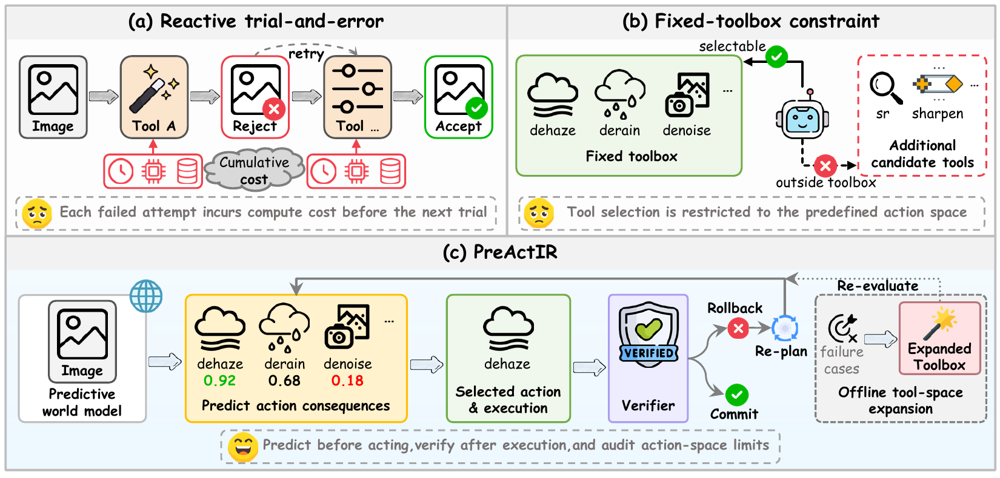

<div align="center">

# Look Before You Restore: Learning to Predict Before Acting for Agentic Image Restoration

[](https://www.python.org/)
[](https://pytorch.org/)
[](#overview)


</div>

PyTorch implementation for the manuscript **Look Before You Restore: Learning to Predict Before Acting for Agentic Image Restoration**.



## Overview

PreActIR predicts what a restoration tool will do **before executing it**. A tool-conditioned world model forecasts changes in residual degradation, image quality, and fidelity, together with content damage, benefit/harm probabilities, and prediction uncertainty. The agent ranks candidate actions, executes the selected tool, and uses an independent verifier to commit or roll back the result before replanning.

The framework has three parts:

- **Predict before acting:** learn action consequences from real before/after tool transitions and use the predictions to rank candidate tools.
- **Act and verify:** check the actual restored output, commit useful changes, roll back rejected changes, and count every real execution against the budget.
- **Audit and adapt:** use an offline candidate-frontier audit to separate tool-selection headroom from tool-space limits, then study targeted tool adaptation on external replay data.

The frontier audit uses clean references **post hoc**; it is an analysis of attainable performance, not a deployment-time decision rule. The manuscript uses one-step planning for its controlled ranking and closed-loop comparisons; the implementation also supports configurable short-horizon planning.

**Current code release.** This repository includes synthetic transition-data generation, belief/world/verifier training, closed-loop inference, evaluation, and adapters for external restoration models. The two bundled configurations use six lightweight classical tools. The complete paper system additionally requires the external restoration toolbox, model checkpoints, and experiment-specific configurations, which are not bundled in this checkout.


## Installation

Use **Python 3.10 or newer** and **PyTorch 2.2 or newer**. Install PyTorch for your CPU or CUDA environment, then install the package from the repository root:

```bash
git clone https://github.com/House-yuyu/PreActIR.git
cd PreActIR
conda create -n preactir python=3.10 -y
conda activate preactir

# Install a compatible PyTorch build first, then:
python -m pip install -e .

# Optional training logs and development dependencies:
python -m pip install -e ".[train,dev]"
```

Core dependencies are declared in [pyproject.toml](pyproject.toml); [requirements.txt](requirements.txt) also lists the training dependencies. Run the commands below from the repository root. The pipeline launchers require Bash.

## Quick Start

Run the self-contained CPU example:

```bash
bash examples/run_debug_pipeline.sh
```

The script creates procedural clean images, synthesizes degraded states and tool transitions, trains the belief encoder, world model, and verifier for one epoch each, and evaluates the agent. It uses [configs/preactir_debug.yaml](configs/preactir_debug.yaml) with `64 × 64` images. Re-running it recreates its generated `data/toy_debug/` and `outputs/debug/` directories.

The main outputs are:

| Output | Path |
| --- | --- |
| Generated dataset | `outputs/debug/interveneir/` |
| Belief checkpoint | `outputs/debug/belief/best.pt` |
| World-model checkpoint | `outputs/debug/world/best.pt` |
| Verifier checkpoint | `outputs/debug/verifier/best.pt` |
| Restored images and evaluation traces | `outputs/debug/agent_eval/` |

This example checks the pipeline on synthetic images; its scores are not the manuscript's benchmark results.

## Data Preparation and Training

### Clean-image splits

For training on your own images, prepare clean-image directories under `data/clean/train/`, `data/clean/val/`, and `data/clean/test/`. Keep clean-image identities disjoint between splits. Alternatively, split an existing image collection with:

```bash
python scripts/prepare_clean_splits.py \
  --input /path/to/clean_images \
  --output data/clean \
  --train-ratio 0.8 --val-ratio 0.1 --seed 42
```

### Generate tool transitions

The standard example configuration, [configs/preactir_small.yaml](configs/preactir_small.yaml), uses `256 × 256` images and covers noise, blur, low light, haze, JPEG artifacts, and rain:

```bash
python scripts/build_intervention_dataset.py \
  --config configs/preactir_small.yaml \
  --clean-root data/clean \
  --output-root data/interveneir
```

The builder saves degraded states, executed tool outputs, spatial masks, supervision labels, `metadata.json`, and `states_{split}.jsonl` / `transitions_{split}.jsonl` manifests. Clean references provide training labels for degradation changes, quality, and damage.

### Train the three learned modules

```bash
python scripts/train_belief.py \
  --config configs/preactir_small.yaml \
  --data-root data/interveneir --device cuda

python scripts/train_world_model.py \
  --config configs/preactir_small.yaml \
  --data-root data/interveneir --device cuda

python scripts/train_verifier.py \
  --config configs/preactir_small.yaml \
  --data-root data/interveneir --device cuda
```

The default configuration trains these modules for 30, 40, and 25 epochs, respectively. Checkpoints are saved under `outputs/belief/`, `outputs/world/`, and `outputs/verifier/` as `best.pt` and `last.pt`. Each training entry point accepts `--resume` and `--save-dir`; use `--device cpu` for CPU runs.

To run data generation, training, and evaluation together with the standard configuration:

```bash
CLEAN_ROOT=data/clean DEVICE=cuda bash examples/run_full_pipeline.sh
```

Keep model dimensions and the ordered degradation/tool vocabularies consistent between data, configurations, and checkpoints.

## Inference and Evaluation

### Restore a single image or a directory

After training the standard configuration, restore a degraded image with:

```bash
python scripts/run_agent.py \
  --config configs/preactir_small.yaml \
  --belief-checkpoint outputs/belief/best.pt \
  --world-checkpoint outputs/world/best.pt \
  --verifier-checkpoint outputs/verifier/best.pt \
  --input /path/to/degraded.png \
  --output outputs/inference --device cuda
```

Replace `--input` with `--input-dir /path/to/degraded_images` for a directory. Default input preprocessing resizes and center-crops to the configured image size; add `--native-resolution` to skip this initial square preprocessing. Results are saved in `restored/`, with per-image action histories in `traces.jsonl` and aggregate call counts in `summary.json`.

To use the CPU debug checkpoints, change the configuration to `configs/preactir_debug.yaml`, use the checkpoint paths from the quick-start table, and set `--device cpu`.

### Evaluate a generated test split

```bash
python scripts/evaluate_agent.py \
  --config configs/preactir_small.yaml \
  --data-root data/interveneir --split test \
  --belief-checkpoint outputs/belief/best.pt \
  --world-checkpoint outputs/world/best.pt \
  --verifier-checkpoint outputs/verifier/best.pt \
  --output outputs/agent_eval --device cuda
```

The lightweight evaluator reports **RGB PSNR/SSIM**, proxy-quality diagnostics, and execution/acceptance statistics. These differ from the paper's six-metric protocol, which evaluates PSNR/SSIM on the Y channel. [scripts/evaluate_paper_metrics.py](scripts/evaluate_paper_metrics.py) provides the paper-metric evaluation interface and requires a compatible `pyiqa` environment and cached metric-model weights.


## Repository Guide

| Component | Location |
| --- | --- |
| Example configurations | [configs/](configs/) |
| Transition-data generation and loading | [preactir/data/](preactir/data/) |
| Belief encoder, world model, and verifier | [preactir/models/](preactir/models/) |
| Candidate generation, planning, and commit/rollback control | [preactir/agent/](preactir/agent/) |
| Classical tools and neural/external adapters | [preactir/tools/](preactir/tools/) |
| Training, inference, and evaluation entry points | [scripts/](scripts/) |
| Example pipelines | [examples/](examples/) |
| Smoke and planner checks | [tests/](tests/) |

## Acknowledgments

This work builds on the restoration benchmarks and tool resources used by MiOIR, AgenticIR, 4KAgent, and HAT. We thank their authors for making these resources available.

## Contact

For questions about PreActIR, please [open an issue](https://github.com/House-yuyu/PreActIR/issues) in this repository.
